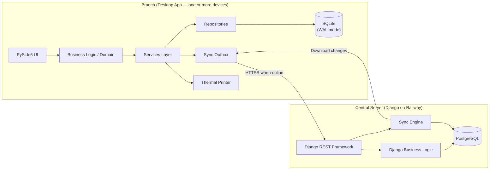
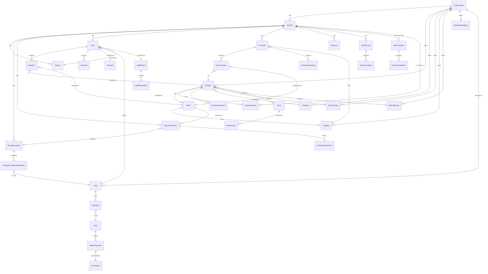
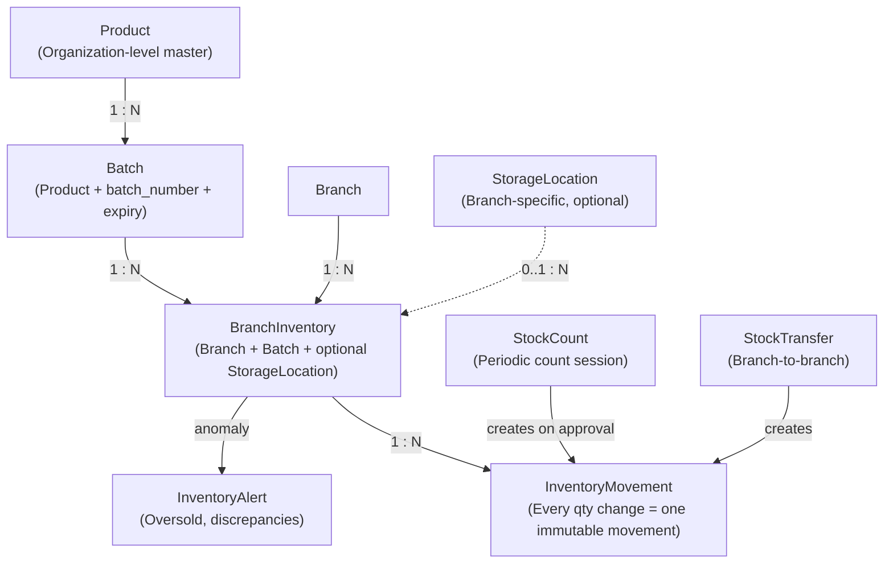
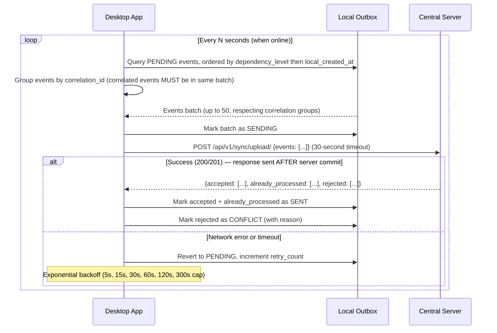
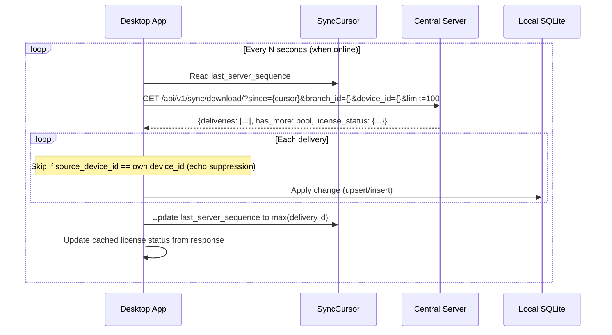
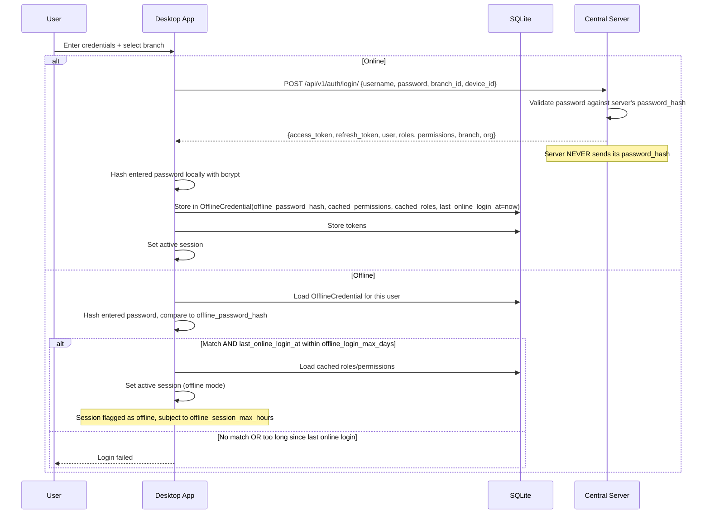
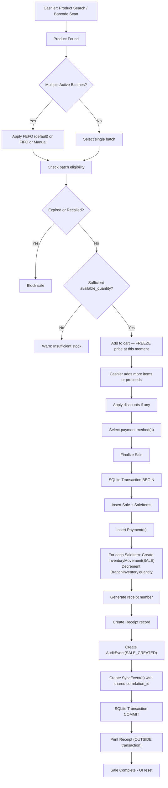

# Pharmacy Management System — Architecture & Implementation Plan (FINAL)

> **Status**: FINALIZED — Ready for Phase 1 coding upon approval  
> **Version**: 2.0  
> **Specification source**: [PHARMACY_MANAGEMENT_SYSTEM_README.md](file:///C:/Users/Leke/Desktop/pharm/PHARMACY_MANAGEMENT_SYSTEM_README.md)  
> **Review source**: [architecture_review.md](file:///C:/Users/Leke/.gemini/antigravity/brain/8bebc9ee-c20b-4cfa-beeb-8644c378a683/architecture_review.md)  
> **Date**: 2026-09-25

---

## Table of Contents

1. [System Architecture](#1-system-architecture)
2. [Database Design](#2-database-design)
3. [Inventory Architecture](#3-inventory-architecture)
4. [Offline Synchronization](#4-offline-synchronization)
5. [Authentication and Permissions](#5-authentication-and-permissions)
6. [Audit System](#6-audit-system)
7. [Sales / POS Architecture](#7-sales--pos-architecture)
8. [Purchasing and Inventory Receiving](#8-purchasing-and-inventory-receiving)
9. [Stock Count and Approval](#9-stock-count-and-approval)
10. [Price Management](#10-price-management)
11. [UI Architecture (PySide6)](#11-ui-architecture-pyside6)
12. [Django Project Structure](#12-django-project-structure)
13. [API Design and Security](#13-api-design-and-security)
14. [Subscription / License Architecture](#14-subscription--license-architecture)
15. [Backup and Recovery](#15-backup-and-recovery)
16. [Testing Strategy](#16-testing-strategy)
17. [Development Phases](#17-development-phases)
18. [MVP Definition](#18-mvp-definition)
19. [Risks](#19-risks)
20. [Recommended Folder Structure](#20-recommended-folder-structure)
21. [Ambiguities Identified](#21-ambiguities-identified)
22. [Architecture Decisions — FROZEN BEFORE CODING](#22-architecture-decisions--frozen-before-coding)
23. [Architecture Readiness Status](#23-architecture-readiness-status)

---

## 1. System Architecture

### 1.1 High-Level Overview



### 1.2 Desktop Application Architecture

The desktop app follows a **layered architecture**:

| Layer | Responsibility |
|---|---|
| **UI (PySide6)** | Rendering, user interaction, signal/slot wiring. No business logic. |
| **Services** | Orchestrate use-cases (e.g. "create sale"), coordinate domain objects and repositories, trigger sync events, manage transactions. |
| **Domain** | Pure business rules (FEFO selection, variance calculation, receipt numbering, permission checks). No I/O. |
| **Repositories** | Data access against SQLite via SQLAlchemy. Encapsulate all SQL. |
| **Sync** | Outbox management, upload/download, conflict resolution, cursor tracking. Runs on a background thread. |
| **Auth** | Local credential cache, token management, session policy, offline authentication. |
| **Printing** | Receipt formatting and thermal printer communication. |
| **Configuration** | Settings, printer config, branch config, environment. |

**Key constraint**: The sync layer is a *background worker* — it never blocks the UI thread or the POS workflow. Communication between sync and services uses Qt signals or a thread-safe queue.

**Multiple devices per branch**: A single branch may have multiple desktop installations (e.g. two POS terminals). Each installation is registered as a separate Device with a unique `device_id` and short `device_code`. The architecture does NOT assume one device per branch.

### 1.3 Central Django REST API Architecture

| Layer | Responsibility |
|---|---|
| **Views / ViewSets (DRF)** | Request/response handling, serialization, permission enforcement. |
| **Serializers** | Input validation, data transformation. |
| **Services** | Business logic that spans multiple models (e.g. processing a synced sale event). |
| **Models** | Django ORM models mapped to PostgreSQL. |
| **Sync Engine** | Receives inbound events, applies idempotently, builds outbound change feeds per branch/device. |
| **Permissions** | Custom DRF permission classes enforcing org/branch/role scope on every endpoint. |
| **Admin** | Django admin for internal ops only, not for end-user pharmacy administration. |

### 1.4 PostgreSQL Architecture

- One PostgreSQL database per deployment. Multi-tenant via row-level `organization_id` filtering.
- All tables carry `organization_id` as a mandatory column. Every query is scoped.
- Indexes on `(organization_id, branch_id)` for all branch-scoped tables.
- `uuid` primary keys for all business entities to support offline ID generation.
- `created_at`, `updated_at` timestamps on all tables — stored as `TIMESTAMP WITH TIME ZONE` (always UTC).

### 1.5 Local SQLite Architecture

- One SQLite database file per desktop installation (per device, per branch).
- Contains: local copies of master data + local transactional data + sync outbox.
- SQLAlchemy ORM with embedded versioned migrations.
- WAL (Write-Ahead Logging) mode enabled for concurrent read/write.
- All timestamps stored as **ISO 8601 strings in UTC** (e.g. `2026-09-25T14:30:00Z`).
- The `local_timestamp` field is the exception — stored with timezone offset (e.g. `2026-09-25T15:30:00+01:00`) for display/audit.
- Database file stored in a well-known app-data path, not the installation directory.
- Periodic maintenance: `PRAGMA optimize` on startup, `VACUUM` weekly.

### 1.6 Offline-First Behavior

The desktop app treats SQLite as the **primary data source for all read and write operations**. The server is a synchronization peer, not a requirement.

```
Every operation:
  1. Validate locally (permissions, stock, business rules)
  2. SQLite Transaction BEGIN
  3. Write business records (Sale, etc.)
  4. Create InventoryMovement records if applicable
  5. Create AuditEvent record
  6. Create SyncEvent(s) in outbox (all sharing a correlation_id)
  7. SQLite Transaction COMMIT
  8. Print receipt if applicable (outside transaction — printer failure must NOT rollback the sale)
  9. Return success to UI immediately
```

The network is never in the critical path of any branch operation.

### 1.7 Timezone Strategy

| Context | Format | Example |
|---|---|---|
| PostgreSQL `created_at`, `updated_at`, `server_timestamp` | `TIMESTAMP WITH TIME ZONE` (UTC) | `2026-09-25 14:30:00+00` |
| SQLite `created_at`, `updated_at` | ISO 8601 string in UTC | `2026-09-25T14:30:00Z` |
| `local_timestamp` (both DBs) | ISO 8601 string with offset | `2026-09-25T15:30:00+01:00` |
| Application logic | Always UTC | Python `datetime.utcnow()` or `datetime.now(timezone.utc)` |
| UI display | Converted to device-local time | Display layer only |

### 1.8 Soft-Delete Policy

**Nothing is ever hard-deleted in this system.** All "deletes" are soft-deletes via `is_active = false`. Queries for active lists filter by `is_active = true`. Historical records (sales, movements, audits) retain FK references to deactivated records. Deactivated records remain queryable when viewing history.

### 1.9 Communication Between Components

| From | To | Mechanism |
|---|---|---|
| UI → Services | Direct Python method calls (same process) |
| Services → Repositories | Direct Python method calls |
| Services → Sync Outbox | Write SyncEvent to SQLite |
| Sync Worker → Server | HTTPS REST calls (httpx, background thread, 30-second timeout) |
| Server → Sync Worker | JSON response payloads on sync endpoints |
| Sync Worker → Local DB | SQLite writes via repositories |
| UI ↔ Sync Worker | Qt signals for status updates (online/offline, pending count) |
| Printer | ESC/POS commands over USB/serial/network |

---

## 2. Database Design

### 2.1 ID Strategy

All business entities use **UUID v4 primary keys** generated client-side. This is essential for offline operation.

```python
import uuid
pk = uuid.uuid4()
```

### 2.2 Core Entity Relationship Diagram



### 2.3 Entity Table Definitions

#### Organization

| Column | Type | Notes |
|---|---|---|
| `id` | UUID PK | |
| `name` | VARCHAR(255) | |
| `code` | VARCHAR(50) UNIQUE | Short org code |
| `address` | TEXT | |
| `phone` | VARCHAR(50) | |
| `email` | VARCHAR(255) | |
| `logo_url` | VARCHAR(500) | |
| `settings` | JSONB/JSON | Org-level config (includes `default_currency`, `offline_session_max_hours`, `offline_login_max_days`, `audit_retention_days`) |
| `is_active` | BOOLEAN | |
| `created_at` | TIMESTAMP | UTC |
| `updated_at` | TIMESTAMP | UTC |

#### Branch

| Column | Type | Notes |
|---|---|---|
| `id` | UUID PK | |
| `organization_id` | UUID FK → Organization | |
| `name` | VARCHAR(255) | |
| `code` | VARCHAR(20) UNIQUE within org | Used in receipt numbering, e.g. "BR01" |
| `address` | TEXT | |
| `phone` | VARCHAR(50) | |
| `email` | VARCHAR(255) | |
| `is_active` | BOOLEAN | |
| `uses_storage_locations` | BOOLEAN | Configurable per branch |
| `initial_stock_loaded` | BOOLEAN | Default false; set true after opening balance entry |
| `settings` | JSONB/JSON | Branch-level config |
| `created_at` | TIMESTAMP | UTC |
| `updated_at` | TIMESTAMP | UTC |

#### Device

| Column | Type | Notes |
|---|---|---|
| `id` | UUID PK | |
| `organization_id` | UUID FK → Organization | Direct scoping |
| `branch_id` | UUID FK → Branch | |
| `name` | VARCHAR(255) | |
| `code` | VARCHAR(5) | Short code for receipt numbering, e.g. "D1", "D2". UNIQUE within branch. |
| `device_identifier` | VARCHAR(255) UNIQUE | Machine-generated fingerprint |
| `is_active` | BOOLEAN | |
| `last_seen_at` | TIMESTAMP | |
| `created_at` | TIMESTAMP | UTC |
| `updated_at` | TIMESTAMP | UTC |

#### User

| Column | Type | Notes |
|---|---|---|
| `id` | UUID PK | |
| `organization_id` | UUID FK → Organization | |
| `username` | VARCHAR(150) | Unique within org |
| `email` | VARCHAR(255) | |
| `full_name` | VARCHAR(255) | |
| `phone` | VARCHAR(50) | |
| `password_hash` | VARCHAR(255) | **Server-side only.** Never transmitted to desktop. |
| `is_active` | BOOLEAN | |
| `is_org_admin` | BOOLEAN | |
| `default_branch_id` | UUID FK → Branch (nullable) | Convenience pre-selection, not a hard binding |
| `created_at` | TIMESTAMP | UTC |
| `updated_at` | TIMESTAMP | UTC |

> [!IMPORTANT]
> The desktop stores a **locally-generated** offline verification hash (see §5.3). The server's `password_hash` is NEVER transmitted to any client. A user is NOT permanently bound to one branch.

#### Role

| Column | Type | Notes |
|---|---|---|
| `id` | UUID PK | |
| `organization_id` | UUID FK → Organization | |
| `name` | VARCHAR(100) | e.g. "Branch Manager" |
| `description` | TEXT | |
| `is_system` | BOOLEAN | Built-in roles can't be deleted |
| `is_active` | BOOLEAN | |
| `created_at` | TIMESTAMP | UTC |
| `updated_at` | TIMESTAMP | UTC |

#### Permission

| Column | Type | Notes |
|---|---|---|
| `id` | UUID PK | |
| `code` | VARCHAR(100) UNIQUE | e.g. `products.create`, `sales.sell`, `stock_counts.approve` |
| `name` | VARCHAR(255) | Human-readable |
| `category` | VARCHAR(100) | For UI grouping |

#### RolePermission

| Column | Type | Notes |
|---|---|---|
| `role_id` | UUID FK → Role | |
| `permission_id` | UUID FK → Permission | |

**UNIQUE constraint**: `(role_id, permission_id)`

#### UserRole

| Column | Type | Notes |
|---|---|---|
| `id` | UUID PK | |
| `user_id` | UUID FK → User | |
| `role_id` | UUID FK → Role | |
| `branch_id` | UUID FK → Branch (nullable) | NULL = org-wide |
| `assigned_by_id` | UUID FK → User | |
| `is_active` | BOOLEAN | |
| `created_at` | TIMESTAMP | UTC |
| `updated_at` | TIMESTAMP | UTC |

**UNIQUE constraint**: `(user_id, role_id, branch_id)`

#### Product

| Column | Type | Notes |
|---|---|---|
| `id` | UUID PK | |
| `organization_id` | UUID FK → Organization | |
| `sku` | VARCHAR(50) | Unique within org |
| `barcode` | VARCHAR(100) | Nullable |
| `name` | VARCHAR(255) | |
| `generic_name` | VARCHAR(255) | Nullable |
| `brand_name` | VARCHAR(255) | Nullable |
| `category_id` | UUID FK → Category | |
| `product_type_id` | UUID FK → ProductType (nullable) | |
| `manufacturer_id` | UUID FK → Manufacturer (nullable) | |
| `description` | TEXT | |
| `active_ingredients` | TEXT | Nullable |
| `strength` | VARCHAR(100) | Nullable |
| `dosage_form` | VARCHAR(100) | Nullable |
| `route` | VARCHAR(100) | Nullable |
| `formulation` | VARCHAR(255) | Nullable |
| `indication` | TEXT | Nullable |
| `contraindications` | TEXT | Nullable |
| `precautions` | TEXT | Nullable |
| `drug_interactions` | TEXT | Nullable |
| `side_effects` | TEXT | Nullable |
| `storage_conditions` | VARCHAR(255) | Nullable |
| `age_suitability` | VARCHAR(100) | Nullable |
| `pregnancy_caution` | BOOLEAN | Default false |
| `prescription_required` | BOOLEAN | Default false |
| `controlled_status` | VARCHAR(50) | Nullable |
| `importer` | VARCHAR(255) | Nullable |
| `regulatory_info` | TEXT | Nullable |
| `image_url` | VARCHAR(500) | Nullable |
| `notes` | TEXT | Nullable |
| `is_active` | BOOLEAN | |
| `created_at` | TIMESTAMP | UTC |
| `updated_at` | TIMESTAMP | UTC |

> [!NOTE]
> All pharmaceutical fields are **nullable**. A cosmetics product need not fill any of them.

#### Category

| Column | Type | Notes |
|---|---|---|
| `id` | UUID PK | |
| `organization_id` | UUID FK → Organization | |
| `name` | VARCHAR(255) | |
| `parent_id` | UUID FK → Category (nullable) | Hierarchical |
| `is_active` | BOOLEAN | |
| `created_at` | TIMESTAMP | UTC |
| `updated_at` | TIMESTAMP | UTC |

#### ProductType

| Column | Type | Notes |
|---|---|---|
| `id` | UUID PK | |
| `organization_id` | UUID FK → Organization | |
| `name` | VARCHAR(100) | e.g. "Medicine", "Cosmetic", "Supplement" |
| `description` | TEXT | Nullable |
| `is_active` | BOOLEAN | |
| `created_at` | TIMESTAMP | UTC |
| `updated_at` | TIMESTAMP | UTC |

#### Manufacturer

| Column | Type | Notes |
|---|---|---|
| `id` | UUID PK | |
| `organization_id` | UUID FK → Organization | |
| `name` | VARCHAR(255) | |
| `country` | VARCHAR(100) | Nullable |
| `contact_info` | TEXT | Nullable |
| `is_active` | BOOLEAN | |
| `created_at` | TIMESTAMP | UTC |
| `updated_at` | TIMESTAMP | UTC |

#### ProductBranch

| Column | Type | Notes |
|---|---|---|
| `id` | UUID PK | |
| `product_id` | UUID FK → Product | |
| `branch_id` | UUID FK → Branch | |
| `is_active` | BOOLEAN | Is this product available in this branch? |
| `reorder_level` | INTEGER | Nullable; branch-specific |
| `settings` | JSON | Nullable; branch-specific product config |
| `created_at` | TIMESTAMP | UTC |
| `updated_at` | TIMESTAMP | UTC |

**UNIQUE constraint**: `(product_id, branch_id)`

**Default availability**: Opt-in. A product must have a `ProductBranch` record to be visible in a branch. The product creation UI provides "Select All Branches" for convenience.

#### ProductDocument

| Column | Type | Notes |
|---|---|---|
| `id` | UUID PK | |
| `product_id` | UUID FK → Product | |
| `name` | VARCHAR(255) | |
| `file_path` | VARCHAR(500) | Local path or URL |
| `document_type` | VARCHAR(50) | Nullable (e.g. "datasheet", "license") |
| `uploaded_by_id` | UUID FK → User | |
| `created_at` | TIMESTAMP | UTC |

#### Supplier

| Column | Type | Notes |
|---|---|---|
| `id` | UUID PK | |
| `organization_id` | UUID FK → Organization | |
| `name` | VARCHAR(255) | |
| `contact_person` | VARCHAR(255) | Nullable |
| `phone` | VARCHAR(50) | Nullable |
| `email` | VARCHAR(255) | Nullable |
| `address` | TEXT | Nullable |
| `is_active` | BOOLEAN | |
| `notes` | TEXT | Nullable |
| `created_at` | TIMESTAMP | UTC |
| `updated_at` | TIMESTAMP | UTC |

#### Batch

| Column | Type | Notes |
|---|---|---|
| `id` | UUID PK | |
| `organization_id` | UUID FK → Organization | |
| `product_id` | UUID FK → Product | |
| `batch_number` | VARCHAR(100) | |
| `manufacturing_date` | DATE | Nullable |
| `expiry_date` | DATE | |
| `purchase_price` | DECIMAL(12,2) | Per-unit cost |
| `supplier_id` | UUID FK → Supplier (nullable) | |
| `invoice_reference` | VARCHAR(100) | Nullable |
| `received_date` | DATE | |
| `status` | VARCHAR(20) | `ACTIVE`, `EXPIRED`, `RECALLED`, `DEPLETED` |
| `regulatory_metadata` | JSON | Nullable |
| `notes` | TEXT | Nullable |
| `created_at` | TIMESTAMP | UTC |
| `updated_at` | TIMESTAMP | UTC |

**UNIQUE constraint**: `(product_id, batch_number)`

**Status transitions**:
- `ACTIVE → EXPIRED`: Automatic. Checked on app startup, periodically (daily), and at POS sale time when `expiry_date < today`.
- `ACTIVE → DEPLETED`: Automatic. When `SUM(BranchInventory.quantity)` across all branches for this batch = 0. Checked after each inventory movement.
- `ACTIVE → RECALLED`: Manual action by admin. Creates an audit event.
- POS **blocks** sale of `EXPIRED`, `RECALLED`, `DEPLETED` batches.

#### BranchInventory

| Column | Type | Notes |
|---|---|---|
| `id` | UUID PK | |
| `organization_id` | UUID FK → Organization | Direct scoping |
| `branch_id` | UUID FK → Branch | |
| `batch_id` | UUID FK → Batch | |
| `storage_location_id` | UUID FK → StorageLocation (nullable) | |
| `quantity` | INTEGER | Current quantity. May be negative from multi-device offline oversell (see §3.4). |
| `reserved_quantity` | INTEGER | Default 0. See §3.5 for lifecycle. |
| `reorder_level` | INTEGER | Nullable; overrides ProductBranch level |
| `status` | VARCHAR(20) | `AVAILABLE`, `DEPLETED`, `QUARANTINED` |
| `last_counted_at` | TIMESTAMP | Nullable |
| `created_at` | TIMESTAMP | UTC |
| `updated_at` | TIMESTAMP | UTC |

**UNIQUE constraint**: `(branch_id, batch_id, storage_location_id)`

**Computed property** (not stored): `available_quantity = quantity - reserved_quantity`

#### StorageLocation

| Column | Type | Notes |
|---|---|---|
| `id` | UUID PK | |
| `organization_id` | UUID FK → Organization | Direct scoping |
| `branch_id` | UUID FK → Branch | |
| `name` | VARCHAR(255) | e.g. "Shelf A", "Refrigerator", "Controlled Cabinet" |
| `description` | TEXT | Nullable |
| `location_type` | VARCHAR(50) | Nullable — for categorization |
| `is_active` | BOOLEAN | |
| `created_at` | TIMESTAMP | UTC |
| `updated_at` | TIMESTAMP | UTC |

#### StorageLocationAssignment

| Column | Type | Notes |
|---|---|---|
| `id` | UUID PK | |
| `organization_id` | UUID FK → Organization | Direct scoping |
| `storage_location_id` | UUID FK → StorageLocation | |
| `user_id` | UUID FK → User | |
| `branch_id` | UUID FK → Branch | Denormalized for fast queries |
| `start_date` | DATE | |
| `end_date` | DATE (nullable) | |
| `is_active` | BOOLEAN | |
| `assigned_by_id` | UUID FK → User | |
| `created_at` | TIMESTAMP | UTC |
| `updated_at` | TIMESTAMP | UTC |

#### InventoryMovement (IMMUTABLE)

| Column | Type | Notes |
|---|---|---|
| `id` | UUID PK | |
| `organization_id` | UUID FK | |
| `branch_id` | UUID FK → Branch | |
| `batch_id` | UUID FK → Batch | |
| `storage_location_id` | UUID FK → StorageLocation (nullable) | |
| `movement_type` | VARCHAR(30) | See enum below |
| `quantity_change` | INTEGER | Positive for inflows, negative for outflows |
| `quantity_before` | INTEGER | Snapshot before this movement |
| `quantity_after` | INTEGER | Snapshot after this movement |
| `reference_type` | VARCHAR(50) | e.g. `sale`, `purchase`, `transfer`, `stock_count` |
| `reference_id` | UUID | FK to the source record |
| `user_id` | UUID FK → User | |
| `device_id` | UUID FK → Device (nullable) | |
| `notes` | TEXT | Nullable |
| `local_timestamp` | TIMESTAMP | Device clock with TZ offset |
| `server_timestamp` | TIMESTAMP (nullable) | Set by server on receipt (UTC) |
| `is_offline` | BOOLEAN | |
| `created_at` | TIMESTAMP | UTC |

> [!CAUTION]
> InventoryMovement records are **immutable**. No UPDATE or DELETE is ever performed on this table. There is no update API endpoint. The desktop has no update method in its repository.

**Movement types**: `STOCK_RECEIVED`, `SALE`, `SALE_RETURN`, `STOCK_TRANSFER_OUT`, `STOCK_TRANSFER_IN`, `STOCK_ADJUSTMENT`, `DAMAGE`, `EXPIRY`, `COUNT_VARIANCE`, `OPENING_BALANCE`

#### InventoryAlert

| Column | Type | Notes |
|---|---|---|
| `id` | UUID PK | |
| `organization_id` | UUID FK | |
| `branch_id` | UUID FK → Branch | |
| `batch_id` | UUID FK → Batch | |
| `alert_type` | VARCHAR(30) | `OVERSOLD`, `RECONCILIATION_MISMATCH`, `NEGATIVE_STOCK` |
| `details` | TEXT (JSON) | Context (expected qty, actual qty, movements involved) |
| `is_resolved` | BOOLEAN | Default false |
| `resolved_by_id` | UUID FK → User (nullable) | |
| `resolved_at` | TIMESTAMP (nullable) | |
| `created_at` | TIMESTAMP | UTC |

#### Sale

| Column | Type | Notes |
|---|---|---|
| `id` | UUID PK | |
| `organization_id` | UUID FK | |
| `branch_id` | UUID FK → Branch | |
| `user_id` | UUID FK → User | |
| `device_id` | UUID FK → Device | |
| `receipt_number` | VARCHAR(50) | Format: `{branch_code}-{device_code}-{YYYYMMDD}-{sequence}` |
| `customer_name` | VARCHAR(255) (nullable) | Optional |
| `customer_phone` | VARCHAR(50) (nullable) | Optional |
| `subtotal` | DECIMAL(12,2) | |
| `discount_amount` | DECIMAL(12,2) | |
| `tax_amount` | DECIMAL(12,2) | |
| `total` | DECIMAL(12,2) | |
| `status` | VARCHAR(20) | `COMPLETED`, `RETURNED`, `PARTIALLY_RETURNED`, `VOIDED`, `CANCELLED` |
| `sale_date` | TIMESTAMP | Local device time with TZ offset |
| `server_received_at` | TIMESTAMP (nullable) | UTC |
| `is_offline` | BOOLEAN | |
| `sync_status` | VARCHAR(20) | `PENDING`, `SYNCED`, `CONFLICT` |
| `notes` | TEXT | Nullable |
| `created_at` | TIMESTAMP | UTC |
| `updated_at` | TIMESTAMP | UTC |

**Index**: `(branch_id, sale_date)`, `(branch_id, receipt_number)` UNIQUE

#### SaleItem (IMMUTABLE after creation)

| Column | Type | Notes |
|---|---|---|
| `id` | UUID PK | |
| `sale_id` | UUID FK → Sale | |
| `product_id` | UUID FK → Product | |
| `batch_id` | UUID FK → Batch | |
| `quantity` | INTEGER | |
| `unit_price` | DECIMAL(12,2) | Price frozen at add-to-cart time — IMMUTABLE |
| `discount_amount` | DECIMAL(12,2) | |
| `line_total` | DECIMAL(12,2) | |
| `created_at` | TIMESTAMP | UTC |

#### SaleReturn

| Column | Type | Notes |
|---|---|---|
| `id` | UUID PK | |
| `organization_id` | UUID FK | |
| `original_sale_id` | UUID FK → Sale | |
| `branch_id` | UUID FK → Branch | |
| `user_id` | UUID FK → User | |
| `device_id` | UUID FK → Device | |
| `return_date` | TIMESTAMP | |
| `reason` | TEXT | |
| `refund_amount` | DECIMAL(12,2) | |
| `status` | VARCHAR(20) | `COMPLETED`, `PENDING_APPROVAL` |
| `approved_by_id` | UUID FK → User (nullable) | |
| `created_at` | TIMESTAMP | UTC |
| `updated_at` | TIMESTAMP | UTC |

#### SaleReturnItem

| Column | Type | Notes |
|---|---|---|
| `id` | UUID PK | |
| `sale_return_id` | UUID FK → SaleReturn | |
| `sale_item_id` | UUID FK → SaleItem | |
| `product_id` | UUID FK → Product | |
| `batch_id` | UUID FK → Batch | |
| `quantity` | INTEGER | |
| `unit_price` | DECIMAL(12,2) | |
| `line_total` | DECIMAL(12,2) | |
| `created_at` | TIMESTAMP | UTC |

#### Payment

| Column | Type | Notes |
|---|---|---|
| `id` | UUID PK | |
| `sale_id` | UUID FK → Sale | |
| `payment_method` | VARCHAR(50) | Configurable values |
| `amount` | DECIMAL(12,2) | |
| `reference` | VARCHAR(100) | Nullable |
| `created_at` | TIMESTAMP | UTC |

#### Receipt

| Column | Type | Notes |
|---|---|---|
| `id` | UUID PK | |
| `sale_id` | UUID FK → Sale | UNIQUE |
| `receipt_number` | VARCHAR(50) | Matches Sale.receipt_number |
| `printed_at` | TIMESTAMP | |
| `printer_name` | VARCHAR(100) | Nullable |
| `reprint_count` | INTEGER | Default 0 |
| `created_at` | TIMESTAMP | UTC |

#### Purchase

| Column | Type | Notes |
|---|---|---|
| `id` | UUID PK | |
| `organization_id` | UUID FK | |
| `branch_id` | UUID FK → Branch | |
| `supplier_id` | UUID FK → Supplier | |
| `user_id` | UUID FK → User | |
| `purchase_reference` | VARCHAR(100) | |
| `invoice_number` | VARCHAR(100) | Nullable |
| `purchase_date` | DATE | |
| `subtotal` | DECIMAL(14,2) | |
| `discount_amount` | DECIMAL(14,2) | |
| `total` | DECIMAL(14,2) | |
| `payment_status` | VARCHAR(20) | `UNPAID`, `PARTIALLY_PAID`, `PAID` |
| `receiving_status` | VARCHAR(20) | `PENDING`, `PARTIALLY_RECEIVED`, `RECEIVED` |
| `notes` | TEXT | Nullable |
| `created_at` | TIMESTAMP | UTC |
| `updated_at` | TIMESTAMP | UTC |

#### PurchaseItem

| Column | Type | Notes |
|---|---|---|
| `id` | UUID PK | |
| `purchase_id` | UUID FK → Purchase | |
| `product_id` | UUID FK → Product | |
| `batch_id` | UUID FK → Batch (nullable) | Set when stock is received and batch created |
| `quantity_ordered` | INTEGER | |
| `quantity_received` | INTEGER | |
| `purchase_price` | DECIMAL(12,2) | Per-unit |
| `selling_price` | DECIMAL(12,2) | Suggested selling price |
| `discount` | DECIMAL(12,2) | |
| `line_total` | DECIMAL(14,2) | |
| `created_at` | TIMESTAMP | UTC |
| `updated_at` | TIMESTAMP | UTC |

#### PurchasePayment

| Column | Type | Notes |
|---|---|---|
| `id` | UUID PK | |
| `purchase_id` | UUID FK → Purchase | |
| `payment_method` | VARCHAR(50) | |
| `amount` | DECIMAL(12,2) | |
| `reference` | VARCHAR(100) | Nullable |
| `payment_date` | DATE | |
| `created_at` | TIMESTAMP | UTC |

#### StockCount

| Column | Type | Notes |
|---|---|---|
| `id` | UUID PK | |
| `organization_id` | UUID FK | |
| `branch_id` | UUID FK → Branch | |
| `device_id` | UUID FK → Device | Device that initiated the count |
| `storage_location_id` | UUID FK → StorageLocation (nullable) | Null = entire branch |
| `count_type` | VARCHAR(30) | `FULL_BRANCH`, `STORAGE_LOCATION`, `CATEGORY`, `SELECTED_PRODUCTS` |
| `status` | VARCHAR(20) | `DRAFT`, `IN_PROGRESS`, `SUBMITTED`, `APPROVED`, `PARTIALLY_APPROVED`, `REJECTED`, `CONFLICT` |
| `started_by_id` | UUID FK → User | |
| `started_at` | TIMESTAMP | |
| `submitted_at` | TIMESTAMP (nullable) | |
| `completed_at` | TIMESTAMP (nullable) | |
| `notes` | TEXT | Nullable |
| `created_at` | TIMESTAMP | UTC |
| `updated_at` | TIMESTAMP | UTC |

#### StockCountItem

| Column | Type | Notes |
|---|---|---|
| `id` | UUID PK | |
| `stock_count_id` | UUID FK → StockCount | |
| `product_id` | UUID FK → Product | |
| `batch_id` | UUID FK → Batch | |
| `storage_location_id` | UUID FK → StorageLocation (nullable) | |
| `system_quantity` | INTEGER | Snapshot at count start time |
| `physical_quantity` | INTEGER | Entered by staff |
| `variance` | INTEGER | `physical_quantity - system_quantity` |
| `current_quantity_at_approval` | INTEGER (nullable) | Recorded at approval time for audit |
| `counted_by_id` | UUID FK → User | |
| `counted_at` | TIMESTAMP | |
| `notes` | TEXT | Nullable |
| `approval_status` | VARCHAR(20) | `PENDING`, `APPROVED`, `REJECTED` |
| `approved_by_id` | UUID FK → User (nullable) | |
| `approved_at` | TIMESTAMP (nullable) | |
| `approval_notes` | TEXT | Nullable |
| `created_at` | TIMESTAMP | UTC |
| `updated_at` | TIMESTAMP | UTC |

#### StockTransfer

| Column | Type | Notes |
|---|---|---|
| `id` | UUID PK | |
| `organization_id` | UUID FK | |
| `source_branch_id` | UUID FK → Branch | |
| `destination_branch_id` | UUID FK → Branch | |
| `status` | VARCHAR(20) | `DRAFT`, `REQUESTED`, `APPROVED`, `DISPATCHED`, `IN_TRANSIT`, `RECEIVED`, `CANCELLED` |
| `requested_by_id` | UUID FK → User | |
| `approved_by_id` | UUID FK → User (nullable) | |
| `dispatched_by_id` | UUID FK → User (nullable) | |
| `received_by_id` | UUID FK → User (nullable) | |
| `requested_at` | TIMESTAMP | |
| `approved_at` | TIMESTAMP (nullable) | |
| `dispatched_at` | TIMESTAMP (nullable) | |
| `received_at` | TIMESTAMP (nullable) | |
| `notes` | TEXT | Nullable |
| `created_at` | TIMESTAMP | UTC |
| `updated_at` | TIMESTAMP | UTC |

#### StockTransferItem

| Column | Type | Notes |
|---|---|---|
| `id` | UUID PK | |
| `stock_transfer_id` | UUID FK → StockTransfer | |
| `product_id` | UUID FK → Product | |
| `batch_id` | UUID FK → Batch | |
| `quantity` | INTEGER | |
| `created_at` | TIMESTAMP | UTC |

#### Price

| Column | Type | Notes |
|---|---|---|
| `id` | UUID PK | |
| `organization_id` | UUID FK → Organization | |
| `product_id` | UUID FK → Product | |
| `branch_id` | UUID FK → Branch (nullable) | Null = org-wide default |
| `selling_price` | DECIMAL(12,2) | |
| `currency` | VARCHAR(10) | From org settings; default `NGN` |
| `is_current` | BOOLEAN | |
| `version` | INTEGER | Monotonically increasing |
| `effective_from` | TIMESTAMP | |
| `effective_to` | TIMESTAMP (nullable) | |
| `created_by_id` | UUID FK → User | |
| `sync_status` | VARCHAR(20) | |
| `created_at` | TIMESTAMP | UTC |
| `updated_at` | TIMESTAMP | UTC |

**Partial unique index**: `UNIQUE (product_id, branch_id) WHERE is_current = true` — enforces at most one current price per product+branch at the database level.

#### PriceHistory (IMMUTABLE)

| Column | Type | Notes |
|---|---|---|
| `id` | UUID PK | |
| `organization_id` | UUID FK | |
| `price_id` | UUID FK → Price | |
| `product_id` | UUID FK → Product | |
| `branch_id` | UUID FK → Branch (nullable) | |
| `old_price` | DECIMAL(12,2) | |
| `new_price` | DECIMAL(12,2) | |
| `changed_by_id` | UUID FK → User | |
| `change_reason` | TEXT | Nullable |
| `version` | INTEGER | |
| `local_timestamp` | TIMESTAMP | With TZ offset |
| `server_timestamp` | TIMESTAMP (nullable) | UTC |
| `sync_status` | VARCHAR(20) | |
| `created_at` | TIMESTAMP | UTC |

#### Expense

| Column | Type | Notes |
|---|---|---|
| `id` | UUID PK | |
| `organization_id` | UUID FK | |
| `branch_id` | UUID FK → Branch | |
| `expense_category_id` | UUID FK → ExpenseCategory | |
| `description` | TEXT | |
| `amount` | DECIMAL(12,2) | |
| `payment_method` | VARCHAR(50) | |
| `expense_date` | DATE | |
| `created_by_id` | UUID FK → User | |
| `approved_by_id` | UUID FK → User (nullable) | |
| `status` | VARCHAR(20) | `DRAFT`, `PENDING_APPROVAL`, `APPROVED`, `REJECTED` |
| `attachment_path` | VARCHAR(500) | Nullable |
| `notes` | TEXT | Nullable |
| `created_at` | TIMESTAMP | UTC |
| `updated_at` | TIMESTAMP | UTC |

#### ExpenseCategory

| Column | Type | Notes |
|---|---|---|
| `id` | UUID PK | |
| `organization_id` | UUID FK → Organization | |
| `name` | VARCHAR(100) | |
| `description` | TEXT | Nullable |
| `is_active` | BOOLEAN | |
| `created_at` | TIMESTAMP | UTC |
| `updated_at` | TIMESTAMP | UTC |

#### AuditEvent (IMMUTABLE — see §6)

#### SyncEvent, SyncCursor, SyncDelivery (see §4)

#### ProcessedEvent (Central — PostgreSQL only)

| Column | Type | Notes |
|---|---|---|
| `event_id` | UUID PK | The SyncEvent.id that was processed |
| `organization_id` | UUID FK | |
| `processed_at` | TIMESTAMP | UTC |

#### OfflineCredential (Local — SQLite only)

| Column | Type | Notes |
|---|---|---|
| `user_id` | UUID PK | |
| `offline_password_hash` | VARCHAR(255) | bcrypt hash generated locally by the desktop |
| `cached_permissions` | TEXT (JSON) | Serialized permission codes |
| `cached_roles` | TEXT (JSON) | Serialized role data |
| `cached_user_profile` | TEXT (JSON) | User details for display |
| `is_active` | BOOLEAN | Cached from server |
| `last_online_login_at` | TIMESTAMP | When the user last authenticated online on THIS device |
| `updated_at` | TIMESTAMP | UTC |

#### License, Subscription, Entitlement (see §14)

#### PrinterConfiguration (Local — SQLite only)

| Column | Type | Notes |
|---|---|---|
| `id` | UUID PK | |
| `branch_id` | UUID FK → Branch | |
| `device_id` | UUID FK → Device | |
| `printer_name` | VARCHAR(255) | |
| `printer_type` | VARCHAR(50) | `thermal_58mm`, `thermal_80mm` |
| `connection_type` | VARCHAR(50) | `usb`, `serial`, `network` |
| `connection_string` | VARCHAR(255) | Port/IP |
| `is_default` | BOOLEAN | |
| `settings` | JSON | |
| `created_at` | TIMESTAMP | UTC |
| `updated_at` | TIMESTAMP | UTC |

### 2.4 Data Residency

| Data | Local SQLite | Central PostgreSQL | Direction |
|---|---|---|---|
| Organization | ✅ (read cache) | ✅ (authoritative) | Server → Desktop |
| Branch | ✅ (read cache) | ✅ (authoritative) | Server → Desktop |
| Device | ✅ | ✅ | Bidirectional |
| User / Role / Permission | ✅ (read cache via OfflineCredential) | ✅ (authoritative) | Server → Desktop |
| Product / Category / ProductType / Manufacturer | ✅ (read cache) | ✅ (authoritative) | Primarily Server → Desktop; may also sync up |
| Supplier | ✅ (read cache) | ✅ (authoritative) | Bidirectional |
| Batch | ✅ | ✅ | Bidirectional |
| BranchInventory | ✅ (own branch) | ✅ (all branches) | Bidirectional (movements, never values) |
| InventoryMovement | ✅ | ✅ | Desktop → Server |
| InventoryAlert | ❌ | ✅ (central-only) | Server generates |
| Sale / SaleItem / Payment / Receipt | ✅ | ✅ | Desktop → Server |
| SaleReturn / SaleReturnItem | ✅ | ✅ | Desktop → Server |
| Purchase / PurchaseItem / PurchasePayment | ✅ | ✅ | Bidirectional |
| StockCount / StockCountItem | ✅ | ✅ | Desktop → Server |
| StockTransfer / StockTransferItem | ✅ | ✅ | Bidirectional (cross-branch) |
| Expense | ✅ | ✅ | Desktop → Server |
| Price / PriceHistory | ✅ | ✅ | Primarily Server → Desktop |
| AuditEvent | ✅ | ✅ | Desktop → Server; Server also generates its own |
| SyncEvent / SyncCursor | ✅ (local-only) | ❌ | Local only |
| SyncDelivery / ProcessedEvent | ❌ | ✅ (central-only) | Central only |
| OfflineCredential | ✅ (local-only) | ❌ | Local only |
| License / Subscription | ✅ (cached) | ✅ (authoritative) | Server → Desktop (via sync response) |
| PrinterConfiguration | ✅ (local-only) | ❌ | Local only |

### 2.5 Important Indexes (Both PostgreSQL AND SQLite)

| Table | Index | Purpose |
|---|---|---|
| Product | `(organization_id, sku)` UNIQUE | SKU lookup |
| Product | `(organization_id, barcode)` | Barcode scan |
| Product | `(organization_id, name)` | Name search |
| Product | FTS5 virtual table (SQLite) / GIN pg_trgm (PostgreSQL) | Fast text search (name, generic_name, brand_name, sku, barcode) |
| Batch | `(product_id, expiry_date)` | FEFO ordering |
| Batch | `(product_id, batch_number)` UNIQUE | Batch lookup |
| BranchInventory | `(branch_id, batch_id, storage_location_id)` UNIQUE | Inventory lookup |
| BranchInventory | `(branch_id, status)` | Available stock queries |
| InventoryMovement | `(branch_id, batch_id, created_at)` | Movement history |
| InventoryMovement | `(reference_type, reference_id)` | Tracing movements to source |
| Sale | `(branch_id, sale_date)` | Date-range queries |
| Sale | `(branch_id, receipt_number)` UNIQUE | Receipt lookup |
| SaleItem | `(sale_id)` | Sale detail |
| AuditEvent | `(organization_id, branch_id, created_at)` | Audit browsing (partition-ready) |
| AuditEvent | `(entity_type, entity_id)` | Entity audit trail |
| SyncEvent | `(status, created_at)` | Outbox processing |
| Price | `(product_id, branch_id) WHERE is_current = true` UNIQUE PARTIAL | Current price enforcement |
| Price | `(product_id, branch_id, is_current)` | Price lookup |

### 2.6 Migration Strategy

**Central (PostgreSQL)**: Django migrations. Tested on staging before production. `pg_dump` backup before every migration. Additive-first strategy.

**Local (SQLite)**: Embedded migration runner. Auto-backup before migrations. Forward-only in production. Desktop app version linked to schema version. A newer app auto-migrates; an older app refuses a newer schema.

---

## 3. Inventory Architecture

### 3.1 Entity Relationships



### 3.2 How They Relate

1. **Product**: Organization-scoped master catalog record. One product definition regardless of how many branches carry it.
2. **Batch**: Belongs to a Product. Carries expiry, manufacturing date, purchase price, supplier.
3. **Branch**: Physical location. Has its own inventory, staff, transactions. May have zero or many storage locations.
4. **BranchInventory**: Junction record — "Branch X has Y units of Batch Z, optionally in StorageLocation W."
5. **StorageLocation**: Optional child of Branch. If `branch.uses_storage_locations = false`, all BranchInventory rows have `storage_location_id = NULL`.
6. **InventoryMovement**: **Write-only immutable ledger**. Every change to quantity is accompanied by a movement record. Movements are never updated or deleted.
7. **StockCount**: Captures physical counts and compares to system quantities. Approved variances generate `COUNT_VARIANCE` movements.
8. **StockTransfer**: Cross-branch movement. Creates `STOCK_TRANSFER_OUT` at source, `STOCK_TRANSFER_IN` at destination.
9. **InventoryAlert**: Server-generated alerts for anomalies (oversold, reconciliation mismatches).

### 3.3 Inventory Quantity Consistency

```
BranchInventory.quantity =
    SUM(InventoryMovement.quantity_change)
    WHERE branch_id = X AND batch_id = Y AND storage_location_id = Z
```

This invariant is maintained incrementally (not recomputed) for performance. A reconciliation utility verifies it periodically:
- Desktop: on startup (local branch data).
- Server: weekly automated job (all branches).
- Discrepancies produce `InventoryAlert(type=RECONCILIATION_MISMATCH)` for manual investigation. They do NOT auto-fix.

### 3.4 Negative Stock Policy

**Locally**: The desktop POS prevents selling more than `available_quantity`. A sale will not proceed if stock is insufficient. This protects single-device branches.

**On the server**: Negative stock is **allowed to occur** from multi-device offline scenarios. When two devices in the same branch both sell from the same batch while offline, the server applies both sets of movements. If this results in `quantity < 0`, the server:
1. Accepts the movements (the physical sales already happened, receipts were printed).
2. Creates `InventoryAlert(type=OVERSOLD, details={batch, expected, actual})`.
3. The branch manager reviews the alert and resolves via stock adjustment, corrected count, or investigation.

### 3.5 Reserved Quantity Lifecycle

| Event | Effect on `reserved_quantity` |
|---|---|
| StockTransfer status → `APPROVED` | `reserved_quantity += transfer_item.quantity` |
| StockTransfer status → `DISPATCHED` | `reserved_quantity -= transfer_item.quantity` (and `quantity` decreases via `STOCK_TRANSFER_OUT` movement) |
| StockTransfer status → `CANCELLED` | `reserved_quantity -= transfer_item.quantity` |

**Invariant**: `reserved_quantity >= 0` and `reserved_quantity <= quantity` (enforced by application logic).

The POS uses `available_quantity = quantity - reserved_quantity` for stock checks.

### 3.6 Opening Balance Workflow

When a pharmacy first adopts the system:
1. Admin creates Products and Batches (with existing batch numbers and expiry dates).
2. Admin enters initial quantities per branch (and per storage location if applicable).
3. System creates `InventoryMovement(type=OPENING_BALANCE, quantity_change=+N)` for each entry.
4. System creates corresponding `BranchInventory` records.
5. `Branch.initial_stock_loaded` is set to `true`.
6. This is a one-time operation per branch.

---

## 4. Offline Synchronization

### 4.1 Design Principles

- **Event-sourced outbox**: Every local write that needs to reach the server produces a `SyncEvent`.
- **Atomic correlated groups**: Events sharing a `correlation_id` are uploaded in the same request and processed in a single server-side transaction. A partial group is never committed.
- **Idempotent processing**: Every event has a globally unique UUID. The server checks `ProcessedEvent` table to reject/no-op duplicates.
- **Operation-based inventory sync**: Inventory changes are synced as movements ("+20", "-5"), never as absolute values.
- **Cursor-based incremental download**: One cursor per device based on `SyncDelivery.id`.
- **Device-level echo suppression**: A device skips deliveries where `source_device_id == self.device_id`.
- **Non-blocking**: Sync runs on a background thread. The UI and POS never wait for sync.
- **Dependency-aware ordering**: Upload sorts events by entity dependency level.

### 4.2 SyncEvent (Local Outbox — SQLite only)

| Column | Type | Notes |
|---|---|---|
| `id` | UUID PK | Globally unique event ID |
| `branch_id` | UUID | |
| `device_id` | UUID | |
| `entity_type` | VARCHAR(50) | e.g. `sale`, `inventory_movement`, `audit_event` |
| `entity_id` | UUID | ID of the local record |
| `operation` | VARCHAR(20) | `CREATE`, `UPDATE` |
| `payload` | TEXT (JSON) | Serialized entity data |
| `correlation_id` | UUID (nullable) | Groups related events for atomic processing |
| `dependency_level` | INTEGER | 1=master data, 2=batch, 3=price/inventory, 4=transaction, 5=line items, 6=movements, 7=audit |
| `schema_version` | INTEGER | Sync payload format version (for forward compatibility) |
| `local_created_at` | TIMESTAMP | Device clock |
| `retry_count` | INTEGER | Default 0 |
| `max_retries` | INTEGER | Default 10; 50 for audit events |
| `last_attempt_at` | TIMESTAMP (nullable) | |
| `status` | VARCHAR(20) | `PENDING`, `SENDING`, `SENT`, `FAILED`, `CONFLICT`, `RESOLVED` |
| `error_message` | TEXT (nullable) | |
| `server_received_at` | TIMESTAMP (nullable) | |

### 4.3 SyncCursor (Local — SQLite only)

One cursor per device (not per entity type):

| Column | Type | Notes |
|---|---|---|
| `device_id` | UUID PK | This device's ID |
| `last_server_sequence` | BIGINT | Last processed SyncDelivery.id |
| `last_sync_at` | TIMESTAMP | |
| `needs_full_resync` | BOOLEAN | Default false; true if cursor is stale |

### 4.4 SyncDelivery (Central — PostgreSQL only)

| Column | Type | Notes |
|---|---|---|
| `id` | BIGSERIAL PK | Monotonically increasing — the download cursor |
| `organization_id` | UUID FK | |
| `entity_type` | VARCHAR(50) | |
| `entity_id` | UUID | |
| `operation` | VARCHAR(20) | |
| `payload` | JSONB | |
| `target_scope` | VARCHAR(20) | `ALL_BRANCHES`, `SPECIFIC_BRANCH`, `ORGANIZATION` |
| `target_branch_id` | UUID (nullable) | For branch-specific deliveries |
| `source_branch_id` | UUID (nullable) | Branch that originated this change |
| `source_device_id` | UUID (nullable) | Device that originated this change (for echo suppression) |
| `source_event_id` | UUID (nullable) | Original SyncEvent.id for dedup |
| `expires_at` | TIMESTAMP | `created_at + 90 days` — for retention cleanup |
| `created_at` | TIMESTAMP | UTC |

**Retention**: SyncDelivery records are retained for 90 days. A periodic server job deletes expired records. Devices that haven't synced in > 90 days must do a **full resync** (re-download all master data + current state) instead of incremental.

### 4.5 Upload Process



**Critical rules**:
- Events with the same `correlation_id` are NEVER split across requests.
- The server processes all events in a correlation group within a single database transaction. If any event fails, the entire group is rejected.
- The server returns success ONLY AFTER the database transaction has durably committed.
- HTTP timeout: 30 seconds per request.
- On timeout: revert to `PENDING`, increment `retry_count`. Idempotency handles the case where the server did process the request.

**Dependency ordering** (upload sorts by `dependency_level`):
1. Organization, Branch, User, Role, Permission (reference data)
2. Product, Category, ProductType, Manufacturer, Supplier
3. Batch
4. BranchInventory, Price
5. Sale, Purchase, StockCount, StockTransfer, Expense
6. SaleItem, PurchaseItem, StockCountItem, StockTransferItem, Payment
7. InventoryMovement
8. AuditEvent

### 4.6 Download Process



**Echo suppression**: Based on `source_device_id`, NOT `source_branch_id`. This ensures that in a multi-device branch, Device A's events ARE downloaded by Device B (so B sees updated inventory), but Device A skips its own events.

### 4.7 Retry Behavior

| Retry Count | Backoff Delay |
|---|---|---|
| 1 | 5 seconds |
| 2 | 15 seconds |
| 3 | 30 seconds |
| 4 | 60 seconds |
| 5 | 120 seconds |
| 6+ | 300 seconds (5 min cap) |

**Standard events**: After 10 consecutive failures → status `FAILED`. Surfaces in Sync Dashboard.

**Audit events**: After 50 consecutive failures → status `FAILED`. Higher threshold because audit completeness is critical. The Sync Dashboard highlights failed audit events as a **critical alert**.

### 4.8 Conflict Handling

| Scenario | Strategy |
|---|---|
| **Two branches sell same product/batch concurrently offline** | No conflict. Each branch has its own `BranchInventory`. The server sees independent movements from different branches. |
| **Same branch, two devices sell same batch offline** | Movements applied in `local_timestamp` order. If this causes `quantity < 0`, server creates `InventoryAlert(OVERSOLD)`. Sale is accepted (already happened physically). |
| **Price changed centrally while branch is offline** | Branch uses cached price. Historical sales retain recorded prices. New price downloaded on next sync. |
| **Product master data changed centrally** | Server-authoritative. Desktop downloads and overwrites local cache. |
| **Two stock counts for same scope from different devices** | Server detects overlap. First-submitted count is processed. Second is marked `CONFLICT` and must be re-done. |

### 4.9 Preventing Duplicate Transactions

Three layers:
1. **UUID event IDs**: Server checks `ProcessedEvent` table.
2. **Receipt number uniqueness**: `(branch_id, receipt_number)` UNIQUE.
3. **Movement reference uniqueness**: `(reference_type, reference_id)` on InventoryMovement prevents duplicate movements.

### 4.10 Full Resync

If a device's cursor is older than the 90-day SyncDelivery retention window, incremental download fails. The device enters **full resync mode**:
1. Download all master data (Products, Categories, Batches, Suppliers, Users, etc.).
2. Download current BranchInventory state for this branch.
3. Download current Prices.
4. Download last 30 days of transactions for this branch.
5. Reset the cursor to the current max SyncDelivery.id.

---

## 5. Authentication and Permissions

### 5.1 Organization Hierarchy

```
Organization (Tenant)
  ├── Branch A
  │   ├── Device A1
  │   ├── Device A2
  │   └── Users: [Alice (Manager), Bob (Cashier)]
  ├── Branch B
  │   ├── Device B1
  │   └── Users: [Alice (Org Admin), Dave (Cashier)]
  └── Org-wide Users: [Alice (Org Admin)]
```

Users belong to an **Organization**, not a Branch. Different roles at different branches via `UserRole(user_id, role_id, branch_id)`. `branch_id = NULL` means org-wide.

### 5.2 Branch Context

At desktop login, the user selects their active branch. This is stored as the session's `active_branch_id` and stamped on every transaction.

### 5.3 Authentication Flow



> [!CAUTION]
> The server NEVER transmits its `password_hash` to the desktop. The desktop generates its own `offline_password_hash` by hashing the user's entered plaintext password with bcrypt locally. This hash is stored in the `OfflineCredential` table and used solely for offline verification.

**Token type**: JWT. Access token expires in ~1 hour. Refresh token expires in ~7 days.

**First login on any device**: MUST be online. There is no `OfflineCredential` until the first successful online login. The app shows: "Internet connection required for first login on this device."

### 5.4 Offline Session Limits

| Setting | Default | Description |
|---|---|---|
| `offline_session_max_hours` | 72 | Max duration of a single offline session before re-authentication required |
| `offline_login_max_days` | 7 | Max days since last online login before offline login is blocked |

Both configurable per organization.

### 5.5 Disabled User While Offline

If a user is disabled centrally (`is_active = false`) while their device is offline:
- The cached `OfflineCredential.is_active` is still `true`. The user can continue operating.
- On next sync: events from the disabled user are accepted (physical transactions already occurred). Server creates `AuditEvent(DISABLED_USER_ACTION)` and notifies the org admin.
- On next online login attempt: server rejects login → desktop clears cached session → user is locked out.

### 5.6 Permission Staleness While Offline

If a user's permissions are changed centrally while offline:
- Desktop uses cached permissions from `OfflineCredential`.
- On sync: server accepts events but checks whether the user had the required permission at the time. If permission was already revoked, server creates `AuditEvent(UNAUTHORIZED_OFFLINE_ACTION)` for management review. The transaction itself is accepted (cannot undo a physical sale).
- On next online login: updated permissions are downloaded and cached.

### 5.7 Permission Enforcement

| Location | Mechanism |
|---|---|
| **Desktop UI** | Widgets hide/disable controls for convenience (not security). |
| **Desktop Service Layer** | Every mutating service method checks `current_user.has_permission(code)`. Raises `PermissionDenied` if not satisfied. This is the enforcement point. |
| **Server API** | Custom DRF permission classes on every ViewSet. Three-layer check (see §13.2). |

### 5.8 Permission Codes (Initial Set)

| Code | Category |
|---|---|
| `products.view` | Products |
| `products.create` | Products |
| `products.edit` | Products |
| `products.delete` | Products |
| `batches.manage` | Batches |
| `inventory.view` | Inventory |
| `inventory.adjust` | Inventory |
| `sales.sell` | Sales |
| `sales.void` | Sales |
| `sales.return` | Sales |
| `prices.view` | Pricing |
| `prices.manage` | Pricing |
| `stock.receive` | Stock |
| `stock.transfer` | Stock |
| `stock_counts.perform` | Stock Counts |
| `stock_counts.approve` | Stock Counts |
| `suppliers.manage` | Suppliers |
| `expenses.create` | Expenses |
| `expenses.approve` | Expenses |
| `reports.view` | Reports |
| `users.manage` | Users |
| `branches.manage` | Branches |
| `settings.manage` | Settings |
| `audit.view` | Audit |
| `subscriptions.manage` | Subscriptions |

These are **seed data**, not hard-coded enums.

---

## 6. Audit System

### 6.1 AuditEvent Model (IMMUTABLE)

| Column | Type | Notes |
|---|---|---|
| `id` | UUID PK | |
| `organization_id` | UUID FK | |
| `branch_id` | UUID FK → Branch | |
| `user_id` | UUID FK → User | |
| `device_id` | UUID FK → Device (nullable) | |
| `action` | VARCHAR(50) | e.g. `SALE_CREATED`, `PRICE_CHANGED` |
| `entity_type` | VARCHAR(50) | e.g. `sale`, `product` |
| `entity_id` | UUID | |
| `data_before` | TEXT (JSON, nullable) | Full snapshot before change |
| `data_after` | TEXT (JSON, nullable) | Full snapshot after change |
| `reason` | TEXT (nullable) | |
| `correlation_id` | UUID (nullable) | Groups related audit events |
| `transaction_id` | UUID (nullable) | Business entity ID that initiated the workflow (e.g. `stock_count.id`) |
| `local_timestamp` | TIMESTAMP | Device clock with TZ offset |
| `server_timestamp` | TIMESTAMP (nullable) | UTC, set by server |
| `is_offline` | BOOLEAN | |
| `source` | VARCHAR(20) | `DESKTOP`, `SERVER`, `SERVER_SYNC` |
| `sync_id` | UUID (nullable) | |
| `created_at` | TIMESTAMP | UTC |

**Partition readiness**: Include `created_at` in any compound indexes. PostgreSQL table can be partitioned by `RANGE (created_at)` when volume requires it.

### 6.2 Two-Layer Audit on Sync

1. **Client audit events** (`source = 'DESKTOP'`): Stored as-is. Represent what the client claims happened.
2. **Server audit events** (`source = 'SERVER_SYNC'`): Generated by the sync processor when processing incoming events. Represent what the server confirmed. For normal operation, both layers match. Discrepancies indicate tampering or bugs.

### 6.3 Local Audit Retention

Audit events older than `audit_retention_days` (configurable, default 90 days) can be purged from SQLite **after confirming they are synced** (status = SENT). This saves device storage. The server retains all audit events permanently.

### 6.4 Audit Sync Priority

Audit events have `max_retries = 50` (vs. 10 for standard events). They are treated as critical data that must reach the server.

### 6.5 Transaction ID Convention

The `transaction_id` field links all audit events in a business workflow:
- Stock count: `transaction_id = stock_count.id` for `STOCK_COUNT_STARTED`, `STOCK_COUNT_SUBMITTED`, `STOCK_COUNT_APPROVED`, `STOCK_COUNT_REJECTED` events.
- Sale: `transaction_id = sale.id`.
- Transfer: `transaction_id = stock_transfer.id`.

This enables tracing: "Who submitted? Who approved? What adjustment resulted?"

---

## 7. Sales / POS Architecture

### 7.1 Complete Sale Flow



### 7.2 Receipt Number Generation

**Format**: `{branch_code}-{device_code}-{YYYYMMDD}-{sequence}`

**Example**: `BR01-D1-20260925-000123`

- `branch_code`: From `Branch.code`, unique per org.
- `device_code`: From `Device.code`, unique per branch. E.g. "D1", "D2".
- `YYYYMMDD`: Local date.
- `sequence`: Per-branch, per-device, per-day counter stored in a local `receipt_sequence` table. Resets daily.

The underlying `Sale.id` is a UUID for global uniqueness. The receipt number is the human-readable display value.

**Multi-device safety**: Because the sequence is per `(branch_id, device_id, date)`, two devices in the same branch never collide.

### 7.3 Cart Price Freezing

When an item is added to the POS cart, the current selling price is captured at that moment and stored on the cart entry. If a price sync occurs mid-session, it does NOT affect items already in the cart. Only new items added after the sync use the new price. This is consistent with `SaleItem.unit_price` being immutable.

### 7.4 FEFO / FIFO Logic

```python
def select_batches_fefo(available_batches: list[BatchStock], qty_needed: int) -> list[BatchAllocation]:
    """
    Select batches by First Expiry First Out.
    available_batches: sorted by expiry_date ASC, then received_date ASC.
    Skips expired, recalled, and depleted batches.
    """
    allocations = []
    remaining = qty_needed
    for batch in available_batches:
        if remaining <= 0:
            break
        if batch.status != 'ACTIVE':
            continue
        take = min(remaining, batch.available_quantity)
        if take > 0:
            allocations.append(BatchAllocation(batch.id, take))
            remaining -= take
    if remaining > 0:
        raise InsufficientStockError(short_by=remaining)
    return allocations
```

---

## 8. Purchasing and Inventory Receiving

*(Unchanged from v1 — see original plan. Supplier management moved to Phase 3.)*

### 8.1 Complete Flow

Create Purchase → Select Supplier → Add PurchaseItems → Save (PENDING) → Receive Stock → For each received item: Create/select Batch → Create/update BranchInventory → Create InventoryMovement(STOCK_RECEIVED) → Update PurchaseItem.quantity_received → Optionally create Price → Create AuditEvent → Create SyncEvent → Update Purchase status.

---

## 9. Stock Count and Approval

### 9.1 Workflow

*(Same state diagram as v1.)*

### 9.2 Detailed Flow

Steps 1–4 unchanged. Step 5 (Manager Review) enhanced:

5. **Manager Review**: Reviews each variance. At approval time, the system records `current_quantity_at_approval` (the live `BranchInventory.quantity` at that moment) for audit. 

   **Guard**: If `current_quantity + variance < 0`, the approval is **blocked**. The manager is shown the current quantity alongside the variance and must either re-count, approve a smaller adjustment, or investigate.

6. **Apply Adjustments** (for approved items):
   - Create `InventoryMovement(type=COUNT_VARIANCE, quantity_change=variance)`.
   - Update `BranchInventory.quantity += variance`.
   - Create `AuditEvent(STOCK_COUNT_APPROVED)` with `data_before` including `current_quantity_at_approval`.
   - Create `SyncEvent`.

### 9.3 Multi-Device Stock Count Conflicts

**Locally**: Only one `IN_PROGRESS` StockCount per (branch, storage_location) scope enforced in SQLite.

**On sync**: Server detects that two StockCounts with overlapping scope and overlapping time ranges arrived from different devices. The first-submitted count is processed normally. The second is marked `CONFLICT` with notes. The branch manager is notified and the conflicting count must be re-done.

---

## 10. Price Management

### 10.1 Price Model

- `Price.branch_id = NULL` → Organization-wide default price.
- `Price.branch_id = X` → Branch-specific override.

**Resolution order**: Branch-specific (where `is_current = true AND branch_id = active_branch`) → Org-wide default (where `is_current = true AND branch_id IS NULL`).

**Partial unique index** enforces at most one current price per `(product_id, branch_id)`.

### 10.2 Price Conflict Policy

- **Org-wide price change** does NOT override existing branch-specific prices. It only sets a new default for branches without overrides.
- **"Force all branches" operation**: Org admin can explicitly push a price to all branches, creating/updating branch-specific Price records for each. Requires `prices.manage` permission.
- **Offline price conflict**: If a branch user changes a price offline and the server has a newer version for the same scope → server version wins. Branch change is flagged as `CONFLICT`. Admin notified.

### 10.3 Atomic Price Switching

Setting `is_current = false` on the old price and `is_current = true` on the new price is done in a **single database transaction**. The partial unique index prevents two "current" prices from existing simultaneously.

---

## 11. UI Architecture (PySide6)

*(Unchanged from v1. See original plan for full folder layout.)*

---

## 12. Django Project Structure

*(Unchanged from v1. See original plan for full app listing.)*

---

## 13. API Design and Security

### 13.1 Major REST Endpoints

*(Same endpoint listing as v1. All prefixed with `/api/v1/`.)*

### 13.2 Three-Layer Tenant Security Model

Every API endpoint enforces tenant isolation through three layers:

**Layer 1 — Queryset Scoping**: Every ViewSet's `get_queryset()` filters by `organization_id = request.user.organization_id`. Objects from other organizations never appear in querysets. This is the primary defense.

**Layer 2 — Object-Level Check**: `get_object()` verifies `obj.organization_id == request.user.organization_id`. Belt-and-suspenders for direct ID lookups.

**Layer 3 — Organization Middleware**: `OrganizationScopeMiddleware` injects `request.organization` from the authenticated user's profile. All views can rely on `request.organization` being correctly set and validated.

For branch-scoped operations, additionally verify the user has a role in that branch (or has an org-wide role).

### 13.3 Sync Upload Validation

The `POST /api/v1/sync/upload/` endpoint validates:
1. The authenticated user belongs to the organization.
2. The `device_id` in the events matches a registered, active Device.
3. The Device belongs to the claimed `branch_id`.
4. Events claiming a different `branch_id` or `device_id` are rejected with `403 Forbidden`.

### 13.4 Server-Side Audit Generation

When the sync processor processes incoming events, it generates its own `AuditEvent` records with `source = 'SERVER_SYNC'`. These confirm what the server actually applied, independent of the client's claimed audit events.

---

## 14. Subscription / License Architecture

### 14.1 Models

*(License, Subscription, Entitlement tables unchanged from v1.)*

### 14.2 Desktop Behavior — License Status via Sync

License status is checked as part of the sync cycle, not on a separate timer. Every sync download response includes `license_status` in its metadata:

```json
{
  "deliveries": [...],
  "has_more": false,
  "license_status": {
    "status": "ACTIVE",
    "plan": "professional",
    "current_period_end": "2026-10-25T00:00:00Z",
    "grace_period_days": 14,
    "entitlements": {"max_branches": "10", "max_devices": "20"}
  }
}
```

The desktop caches this response locally.

### 14.3 Grace Period Behavior — Corrected

License status and offline duration are **separate concerns**:

| Cached License Status | Behavior |
|---|---|
| `TRIAL` or `ACTIVE` | Full functionality, regardless of how long the device has been offline. Show "last synced X days ago" if > 7 days. |
| `EXPIRED`, offline < `grace_period_days` (default 14) | Warning: "Subscription expired. Renew within X days." Full functionality. |
| `EXPIRED`, offline > `grace_period_days` | Read-only mode. Cannot create sales/purchases. |
| `SUSPENDED` | Read-only mode. |
| `Unknown` (never checked / no cached status) | Require online login. Cannot operate. |

> [!IMPORTANT]
> An `ACTIVE` subscription does NOT degrade merely because the device has been offline for a long time. The grace period applies only to `EXPIRED` licenses.

---

## 15. Backup and Recovery

### 15.1 Local Backup (Desktop)

- Auto-backup SQLite daily (configurable time or on first launch).
- Backup before any schema migration.
- "Backup Now" button in Settings.
- "Restore from Backup" lists available backups.
- Retain last 30 daily backups.
- After restore: re-evaluate sync outbox. Events already synced (confirmed SENT) are skipped. Pending events are re-uploaded.

### 15.2 Central Backup (PostgreSQL)

- `pg_dump` daily.
- WAL archiving for PITR.
- Retention: daily for 30 days, weekly for 6 months, monthly for 2 years.

### 15.3 Initial Sync Scope for New Device

When a new device is set up (first login), it downloads:

**Full download**:
- Organization, Branch, Device, Users, Roles, Permissions
- Products, Categories, ProductTypes, Manufacturers, Suppliers, ExpenseCategories
- Active Batches
- BranchInventory (for this branch only)
- Current Prices

**Partial download (last 30 days)**:
- Sales, Purchases, StockCounts, Expenses, InventoryMovements (for this branch)

**Not downloaded**:
- Historical sales beyond 30 days
- Audit events (too large)
- Other branches' transactions

Historical queries beyond the local cache hit the server API when online.

### 15.4 Device Loss / Unsynced Data Risk

If a device fails with unsynced transactions, those transactions are lost from the server's perspective. The pharmacy has physical receipts for completed sales. Mitigations:
- Frequent automated sync (every few seconds when online).
- Daily local backup protects against corruption but not hardware theft.
- Post-MVP: "Manual Transaction Entry" feature for re-entering sales from physical receipts (`source = 'MANUAL_ENTRY'`).

---

## 16. Testing Strategy

*(Unchanged from v1. All test categories remain as specified.)*

---

## 17. Development Phases (Corrected)

### Phase 1 — Foundation (Weeks 1–2)
- Project scaffolding (monorepo: desktop/ + server/)
- Development environment (virtualenvs, Docker for PostgreSQL, `.env.example`)
- Desktop: SQLAlchemy base models, database initialization, migration framework
- Server: Django project, base models, settings (dev/test/prod), initial migration
- UUID strategy, timestamp handling (UTC everywhere), base model classes
- CI setup (linting, basic test runner)

### Phase 2 — Authentication & Organization Structure (Weeks 3–4)
- Server: Organization, Branch, Device, User, Role, Permission, UserRole models
- Server: Auth endpoints (login, token refresh, me)
- Server: Org/branch scoping middleware + three-layer security
- Desktop: Login screen, OfflineCredential system, session management
- Desktop: Branch selection at login, offline session limits
- Permission framework (both sides)
- **Test**: Auth flow online/offline, permission checks, disabled user handling

### Phase 3 — Product Catalog, Categories & Suppliers (Weeks 5–6)
- Server: Product, Category, ProductType, Manufacturer, Supplier, ProductBranch, ProductDocument models + API
- Desktop: Product list (paginated Model/View with FTS5 search), product detail/form
- Desktop: Category management, supplier management
- Desktop: Local product cache in SQLite
- **Test**: Product CRUD, search, barcode lookup

### Phase 4 — Batches, Inventory & Basic Pricing (Weeks 7–8)
- Server: Batch, BranchInventory, StorageLocation, StorageLocationAssignment, InventoryMovement, InventoryAlert models + API
- Server: Price model (basic — product_id, branch_id, selling_price, is_current, version) + API
- Desktop: Batch management, inventory list view, storage location management
- Desktop: Price resolver (branch override → org default)
- Desktop: Opening balance workflow
- **Test**: Batch creation, inventory queries, storage location toggle, price resolution, opening balance

### Phase 5 — Core Sync (Weeks 9–11)
- Server: SyncDelivery, ProcessedEvent models, sync upload/download endpoints, idempotent event processor
- Server: Server-side audit event generation on sync processing
- Desktop: SyncEvent outbox, SyncCursor, background sync worker
- Desktop: Upload (dependency-aware ordering, atomic correlation groups)
- Desktop: Download (device-level echo suppression, cursor advancement)
- Desktop: Sync dashboard (online/offline status, pending count, failed count)
- **Test**: Movement ledger consistency, sync upload/download, idempotency, echo suppression, offline→online

### Phase 6 — Sales / POS (Weeks 12–14)
- Server: Sale, SaleItem, Payment, Receipt models + sync processing
- Desktop: POS screen (product search, barcode scan, cart with frozen prices)
- Desktop: FEFO/FIFO batch selection, expired/recalled/depleted blocking
- Desktop: Payment handling, receipt number generation (`{branch}-{device}-{date}-{seq}`)
- Desktop: Sale finalization (atomic: sale + items + payments + movements + receipt + audit + sync)
- Desktop: Receipt printing (thermal 58mm/80mm)
- **Test**: Full POS flow, offline sale, barcode scan, FEFO, receipt uniqueness across devices

### Phase 7 — Returns & Voids (Week 15)
- Server: SaleReturn, SaleReturnItem models + sync processing
- Desktop: Return/void workflows, inventory reversal movements
- **Test**: Partial return, full return, void, no-delete policy

### Phase 8 — Purchasing & Receiving (Weeks 16–17)
- Server: Purchase, PurchaseItem, PurchasePayment models + API
- Desktop: Purchase creation, stock receiving (batch creation, inventory movements)
- **Test**: Purchase → receive → batch → inventory flow

### Phase 9 — Stock Counts & Approval (Weeks 18–19)
- Server: StockCount, StockCountItem models + approval API + multi-device conflict detection
- Desktop: Stock count creation, physical count entry, variance review
- Desktop: Approval with negative-quantity guard and `current_quantity_at_approval`
- **Test**: Count workflow, approval, rejection, variance calculation, multi-device conflict

### Phase 10 — Stock Transfers (Week 20)
- Server: StockTransfer, StockTransferItem + status workflow API
- Desktop: Transfer request, approval, dispatch, receipt
- Desktop: reserved_quantity lifecycle management
- **Test**: Transfer workflow, multi-branch sync, reserved quantity

### Phase 11 — Price Versioning & Sync (Week 21)
- Server: PriceHistory model, price versioning API, "force all branches" operation
- Desktop: Price management UI, price change history, sync of price changes
- **Test**: Price versioning, offline price behavior, conflict resolution, force-all-branches

### Phase 12 — Expenses (Week 22)
- Server: Expense, ExpenseCategory models + API
- Desktop: Expense entry, category management, approval
- **Test**: Expense CRUD, approval workflow

### Phase 13 — Audit Trail UI (Week 23)
- Server: AuditEvent query API (read-only, paginated, filterable)
- Desktop: Audit log viewer (paginated, filterable by entity/user/date/branch/device)
- Local audit retention cleanup
- **Test**: Audit completeness, retention, two-layer audit consistency

### Phase 14 — Dashboards & Reports (Weeks 24–25)
- Server: Report endpoints
- Desktop: Dashboard cards, sales/inventory/expense reports
- **Test**: Report accuracy

### Phase 15 — Subscription & Licensing (Week 26)
- Server: License, Subscription, Entitlement models + API
- Desktop: License validation via sync response, grace period behavior
- **Test**: Trial, expiry, grace, read-only mode, active-license-while-offline

### Phase 16 — Hardening & Backup (Weeks 27–28)
- Desktop: Automated SQLite backup, restore UI, SQLite maintenance (VACUUM, optimize)
- Server: Backup documentation, SyncDelivery cleanup job, AuditEvent archival
- UI polish, error handling, security review, performance profiling
- Inventory reconciliation utility

### Phase 17 — Packaging & Distribution (Weeks 29–30)
- PyInstaller build, Inno Setup installer
- Installation documentation, user quick-start guide

---

## 18. MVP Definition

*(Unchanged from v1.)*

---

## 19. Risks

### 19.1 Technical Risks

| Risk | Severity | Mitigation |
|---|---|---|
| **Multi-device offline oversell** | High | Movement-based sync, InventoryAlert system, branch manager review. Documented known limitation. |
| **Offline sync conflicts** | High | Idempotent events, atomic correlation groups, conflict flagging, comprehensive tests. |
| **Clock skew between devices** | Medium | Server-assigned sequence numbers for ordering. Local timestamps for display/audit only. |
| **SQLite migration failures** | High | Auto-backup before every migration, forward-only, schema version check. |
| **Large sync backlog** | Medium | Batched upload (50/request), paginated download, 90-day retention with full-resync fallback. |
| **Password security offline** | Medium | bcrypt for offline hash. Desktop-generated, never server-transmitted. OS-level file restrictions. |
| **PySide6 UI thread blocking** | Medium | All I/O on background threads. Never block the event loop. |
| **SyncDelivery table growth** | Medium | 90-day retention, periodic cleanup job, partition-ready design. |
| **AuditEvent table growth** | Medium | Partition-ready (by created_at). Local retention policy. Server archival strategy. |
| **Receipt printer compatibility** | Medium | ESC/POS standard. Abstract printer interface. Test with common models. |

### 19.2 Business Risks

| Risk | Severity | Mitigation |
|---|---|---|
| **First customer's config driving architecture** | High | Everything configurable. No hard-coded branch counts, shelf counts, or product types. |
| **Internet reliability** | High | Offline-first is core. Extended offline (days/weeks) is supported. |
| **Multi-branch inventory discrepancies** | Medium | Movement ledger, reconciliation utility, stock count workflow. |
| **Subscription blocking operations** | Medium | Grace periods, read-only degradation, separate offline-duration from license-status. |

---

## 20. Recommended Folder Structure

*(Unchanged from v1. See original plan for full tree.)*

---

## 21. Ambiguities Identified

*(Unchanged from v1. 10 ambiguities documented.)*

---

## 22. Architecture Decisions — FROZEN BEFORE CODING

> [!CAUTION]
> These decisions are FINAL. They must not be changed during implementation without explicit review and approval. Changing them after coding begins is expensive.

### Identity & IDs

| # | Decision | Resolution |
|---|---|---|
| 1 | **Primary key strategy** | UUID v4, generated client-side. All business entities. No auto-increment IDs for business entities. |
| 2 | **Device identification** | Machine-generated fingerprint + server-registered UUID. Device gets a short `code` (e.g. "D1") for receipt numbering. UNIQUE within branch. |

### Synchronization

| # | Decision | Resolution |
|---|---|---|
| 3 | **Sync event format** | JSON. `{id, branch_id, device_id, entity_type, entity_id, operation, payload, correlation_id, dependency_level, schema_version, local_created_at}`. |
| 4 | **Sync event grouping** | Events with the same `correlation_id` are uploaded and processed atomically in a single server transaction. Never split across requests. |
| 5 | **Echo suppression** | Filter on `source_device_id`, NOT `source_branch_id`. Supports multi-device branches. |
| 6 | **Upload ordering** | Dependency-aware topological sort by `dependency_level`, then FIFO within each level. |
| 7 | **Download cursor** | Single cursor per device. `SyncDelivery.id` (BIGSERIAL) is the monotonic cursor. |
| 8 | **SyncDelivery retention** | 90 days. Devices offline longer require full resync. |
| 9 | **HTTP timeout** | 30 seconds per upload request. |
| 10 | **Server commit rule** | Server returns success ONLY AFTER the database transaction durably commits. |

### Inventory

| # | Decision | Resolution |
|---|---|---|
| 11 | **Inventory sync strategy** | Movement-based (deltas). Never sync absolute quantities. |
| 12 | **Negative stock policy** | Allowed on server from multi-device offline conflicts. Creates `InventoryAlert(OVERSOLD)`. Not allowed locally (POS checks `available_quantity`). |
| 13 | **Reserved quantity lifecycle** | Incremented at transfer APPROVED, decremented at DISPATCHED or CANCELLED. |
| 14 | **Batch status transitions** | ACTIVE→EXPIRED (auto, daily + POS check). ACTIVE→DEPLETED (auto, on zero quantity). ACTIVE→RECALLED (manual). |
| 15 | **Inventory movements** | IMMUTABLE. No update, no delete, ever. |

### Authentication & Sessions

| # | Decision | Resolution |
|---|---|---|
| 16 | **Auth mechanism** | JWT. Access token ~1 hour. Refresh token ~7 days. |
| 17 | **Offline auth** | Desktop generates its own bcrypt hash locally. Server NEVER sends its hash. |
| 18 | **Offline session max** | Configurable: default 72 hours. Offline login allowed if last online login within 7 days. |
| 19 | **First login** | Must be online. No offline operation without prior online login on that device. |

### Pricing

| # | Decision | Resolution |
|---|---|---|
| 20 | **Price resolution order** | Branch-specific override → Org-wide default. |
| 21 | **Price conflict policy** | Org-wide changes do NOT override branch-specific prices. Explicit "force all branches" required. |
| 22 | **Cart price freezing** | Price captured at add-to-cart, not at checkout. |
| 23 | **Price atomicity** | `is_current` switching is transactional. Partial unique index enforces one current price per scope. |

### Audit

| # | Decision | Resolution |
|---|---|---|
| 24 | **Audit immutability** | Append-only. No update, no delete, ever. No exception for any user role. |
| 25 | **Audit data format** | Full JSON snapshots (`data_before`, `data_after`). |
| 26 | **Two-layer audit** | Desktop sends client audit (`DESKTOP`). Server generates confirmation audit (`SERVER_SYNC`). |

### Database & Infrastructure

| # | Decision | Resolution |
|---|---|---|
| 27 | **Timezone handling** | PostgreSQL: `TIMESTAMPTZ` (UTC). SQLite: ISO 8601 UTC. `local_timestamp`: with TZ offset. Application logic: UTC. UI: converts to local. |
| 28 | **Soft delete policy** | Nothing hard-deleted. All deletions via `is_active = false`. |
| 29 | **Multi-tenant isolation** | Row-level `organization_id` filtering. Three-layer enforcement (queryset, object, middleware). |
| 30 | **Receipt number format** | `{branch_code}-{device_code}-{YYYYMMDD}-{sequence}`. Unique across devices without coordination. |

### Subscription

| # | Decision | Resolution |
|---|---|---|
| 31 | **License check mechanism** | Piggybacked on sync response. No separate timer. |
| 32 | **Grace period scope** | Applies only to EXPIRED licenses. ACTIVE license never degrades regardless of offline duration. |

---

## 23. Architecture Readiness Status

### Critical Issues Resolved

| Issue | Status |
|---|---|
| 4.1 — Receipt number collision between devices | ✅ Fixed. Format now includes `device_code`. |
| 5.1 — Server password hash transmitted to desktop | ✅ Fixed. Desktop generates its own offline hash. Server never sends its hash. |
| 1.2 — Echo suppression wrong scope | ✅ Fixed. Now filters on `source_device_id`. |
| 1.1 — Correlated events not atomic | ✅ Fixed. Same `correlation_id` = same request, same server transaction. |
| 14.1 — POS built before pricing exists | ✅ Fixed. Basic Price model in Phase 4, before POS in Phase 6. |

### Medium Issues Resolved

All 22 medium issues from the review have been incorporated:
- Negative stock policy defined (§3.4)
- Reserved quantity lifecycle defined (§3.5)
- Batch status transitions defined (Batch table definition)
- Opening balance workflow added (§3.6)
- Reconciliation mechanism specified (§3.3)
- ProductBranch default policy documented (ProductBranch table)
- Multi-device oversell documented (§3.4)
- Stock count conflict detection defined (§9.3)
- Offline permission staleness policy defined (§5.6)
- Disabled user policy defined (§5.5)
- Offline session max duration added (§5.4)
- Audit retry threshold increased (§6.4)
- Audit local retention defined (§6.3)
- Stock count negative-quantity guard added (§9.2)
- Price branch vs org conflict policy refined (§10.2)
- Price partial unique index added (Price table)
- 6 missing table definitions added (§2.3)
- organization_id added to BranchInventory, StockCount, SaleReturn, Price, Device, StorageLocation, StorageLocationAssignment
- Soft-delete policy defined (§1.8)
- Timezone strategy defined (§1.7)
- UserRole timestamps/audit added (UserRole table)
- Sync upload validation defined (§13.3)
- Server-side audit generation defined (§13.4, §6.2)
- License status separated from offline duration (§14.3)
- Initial sync download scope defined (§15.3)
- SyncDelivery retention/archival defined (§4.4)
- FTS5/pg_trgm search defined (§2.5)
- Three-layer security model documented (§13.2)
- Dependency-aware upload ordering defined (§4.5)

### Blocking Decisions Remaining

**None.** All 32 architecture decisions are frozen.

### Contradictions Remaining

**None.** Consistency audit verified:
- ✅ Receipt numbers include device code everywhere (§7.2, Sale table, Device table)
- ✅ Password hashes are never transmitted from server anywhere (§5.3, User table, OfflineCredential table)
- ✅ Echo suppression is device-level everywhere (§4.1, §4.6, SyncDelivery table)
- ✅ Basic pricing exists before POS (Phase 4 before Phase 6)
- ✅ Inventory uses movements everywhere, never absolute quantities (§3, §4.1, §4.8)
- ✅ All FK-referenced tables are defined (Manufacturer, ProductType, ExpenseCategory, Receipt, PurchasePayment, ProductDocument added)
- ✅ organization_id present on all directly-queried tables
- ✅ Permission enforcement is identical desktop (service layer) and server (DRF permission classes)
- ✅ All mutating workflows include audit logging
- ✅ Correlated events prevent partial sync
- ✅ No assumption of specific branch counts, shelf counts, or devices-per-branch
- ✅ No feature requires Internet during normal pharmacy operation
- ✅ No hard-delete behavior
- ✅ Timezone strategy consistent across all timestamp fields

### Ready for Phase 1 Coding

**YES** — pending your approval.
